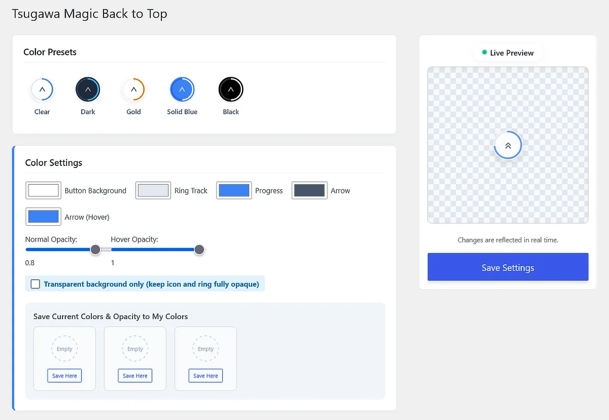
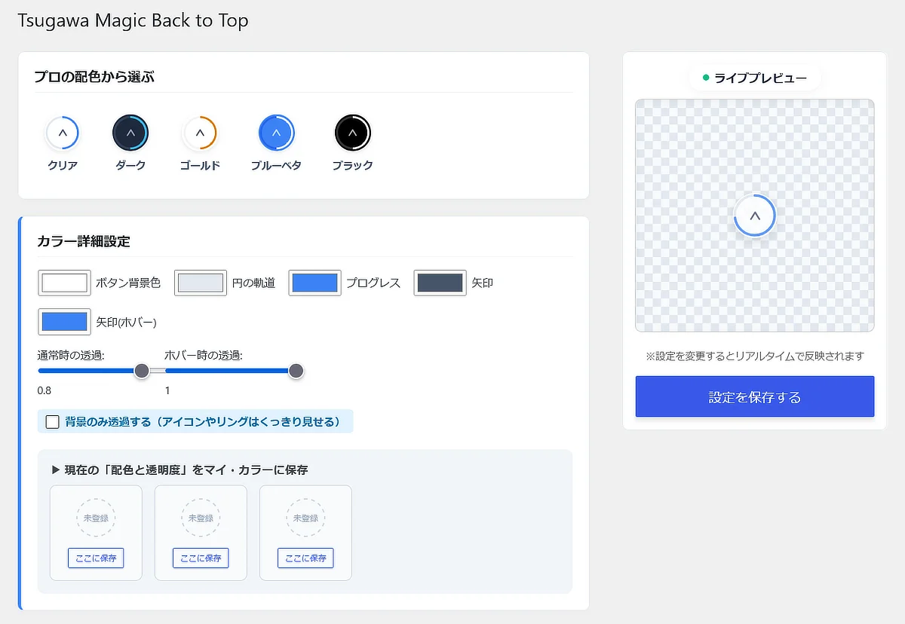

# Tsugawa Magic Back to Top

A beautiful, ultra-lightweight Back to Top button designed for creators. No coding required.  
クリエイターのために作られた、美しく超軽量な「トップへ戻る」ボタン。ノーコードで直感的に。

[English](#english) | [日本語](#日本語)

---

## English

### 🌍 Overview
Built with the philosophy of being "Friendly for Non-Engineers," **Tsugawa Magic Back to Top** is designed specifically for designers, bloggers, and creators. It adds a highly customizable, pixel-perfect floating button to your site without requiring a single line of code.

No heavy libraries. Built with pure Vanilla JS and modern CSS.

* **Official Plugin Page:** [https://tsugawa.tv/plugins/magic-back-to-top/](https://tsugawa.tv/plugins/magic-back-to-top/en/)
* **100% Free for Commercial Use:** Safely use it on your personal blogs or client projects.

### ✨ Key Features
* **Design First:** Beautifully adapts to all devices, from desktop monitors to small mobile screens.
* **Scroll Progress Ring:** The circular ring gradually fills as users scroll down the page.
* **Position Selection:** Choose to display the button on the bottom-right or bottom-left of the screen.
* **Multiple Arrow Icons:** Choose from a variety of beautiful, scalable SVG arrow styles.
* **Timing & Speed Control:** Adjust the scroll amount (in px) required to show the button, and fine-tune the smooth return-to-top animation speed.
* **Pixel-Perfect Control:** Fine-tune the button's size and offset positions down to the pixel.
* **Customizable Colors & Opacity:** Change colors to match your brand, adjust transparency for normal/hover states, and save custom presets.
* **Ultra Lightweight:** Designed to have a minimal impact on performance.
* **CSS-Based Mobile Hiding:** Cache-friendly mobile hiding using CSS media queries.
* **Exclude Pages:** Easily disable the button on specific pages by slug or ID.
* **Export for External LPs:** Generate standalone code to use on non-WordPress landing pages.

### 🖥️ Settings UI

### 🚀 Installation

> **⚠️ Important Download Notice:**
> ✅ **Download:** `tsugawa-magic-back-to-top.zip` (From the Releases page)
> ❌ **Do NOT use:** `Source code (zip)` or `Source code (tar.gz)`

1. Download the latest `.zip` file from the **Releases** page.
2. In your WordPress admin panel, go to `Plugins -> Add New Plugin -> Upload Plugin`.
3. Upload the `.zip` file and click `Install Now`.
4. Activate the plugin and go to `Settings -> Magic B2T` to customize.

---

## 日本語

### 🌍 概要
「非エンジニアであっても分かりやすく」。
**Tsugawa Magic Back to Top** は、デザイナーやブロガーの方々のために設計されたプラグインです。コードの知識は一切不要。ピクセル単位で調整可能な美しい「トップへ戻る」ボタンを直感的に追加できます。

重いライブラリは使用せず、純粋なVanilla JSとモダンなCSSのみで構築されています。

* **公式プラグインページ:** [https://tsugawa.tv/plugins/magic-back-to-top/](https://tsugawa.tv/plugins/magic-back-to-top/)
* **完全無料・商用利用可能:** ご自身のブログはもちろん、クライアントの商用プロジェクト等でも安心して自由にご利用いただけます。

### ✨ 主な機能
* **デザインファーストのUI:** 幅広いPCモニターから小さなスマホ画面まで美しく適応します。
* **スクロール進捗リング:** ページを読み進めるにつれて、リングが徐々に360度まで塗りつぶされます。
* **配置位置の選択:** ボタンの表示位置を画面の「右下」または「左下」から選択できます。
* **選べる矢印アイコン:** 数種類の美しいSVGアイコンからお好みのスタイルを選択可能です。
* **表示タイミングと速度制御:** ボタンが出現するまでのスクロール量（px）と、最上部に戻るまでのアニメーション速度を自由に調整できます。
* **ピクセルパーフェクトな制御:** ボタンのサイズと表示位置を1ピクセル単位で微調整可能です。
* **カラーと透明度のカスタマイズ:** ブランドに合わせて色を変更し、通常時・ホバー時の透明度（不透明度）を個別に調整可能。お気に入り配色としての保存もできます。
* **超軽量設計:** サイトパフォーマンスへの影響を最小限に抑えます。
* **CSSベースのモバイル非表示:** ページキャッシュと競合しないCSSによる非表示機能を搭載。
* **特定ページの除外:** スラッグやIDを入力するだけで、特定のページでボタンを無効化できます。
* **外部LP用のエクスポート:** WordPress以外のサイトでも使えるよう、独立したコードを出力できます。

### 🖥️ 管理画面UI

### 🚀 インストール方法

> **⚠️ ダウンロード時のご注意:**
> ✅ **ダウンロードするファイル:** `tsugawa-magic-back-to-top.zip` （Releasesページより）
> ❌ **使用してはいけないファイル:** `Source code (zip)` や `Source code (tar.gz)`

1. GitHubの **Releases** ページから最新の `.zip` ファイルをダウンロードします。
2. WordPress管理画面の `プラグイン -> 新規追加 -> プラグインのアップロード` へ移動します。
3. ダウンロードした `.zip` ファイルをアップロードしてインストール、有効化します。
4. `設定 -> Magic B2T` へ移動し、デザインをカスタマイズしてください。

---

## 💬 Support & Bug Reports
If you find any bugs or have feature requests, please open an issue on our [GitHub Issues](https://github.com/TsugawaTV/tsugawa-magic-back-to-top/issues).  
バグの報告や機能改善のご要望は、[Issues](https://github.com/TsugawaTV/tsugawa-magic-back-to-top/issues) よりお寄せください。

## 📄 License & Credits
* Released under the [GPLv2 License](https://www.gnu.org/licenses/gpl-2.0.html).
* Arrow icons provided by [Lucide](https://lucide.dev/) (MIT License).
